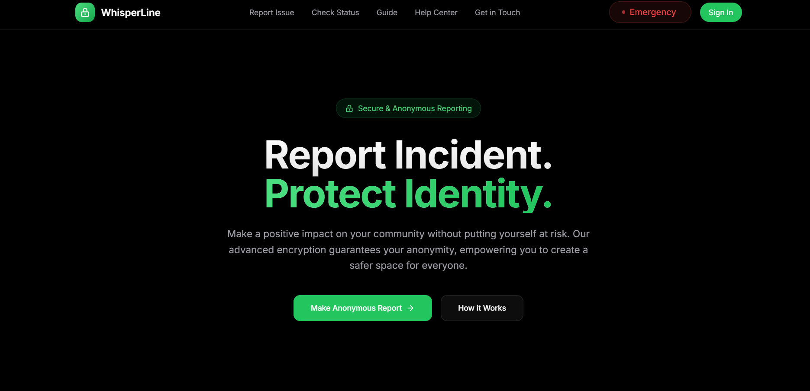

<div align="center">
  <br />
  <a href="your-demo-video-link" target="_blank">
    
  </a>
  <br />
  <div>
    
    
    
    
  </div>
  <h3 align="center">🔒 Anonymous Reporting App 🔒</h3>
  <div align="center">
    A secure platform for anonymous incident reporting
  </div>
</div>

---

## 📑 Table of Contents

1. 💡 [Introduction](#introduction)
2. 🛠️ [Tech Stack](#tech-stack)
3. ✨ [Features](#features)
4. 🚀 [Quick Start](#quick-start)
5. 🔧 [Environment Setup](#environment)
6. 🌐 [Deployment](#deployment)

---

## 💡 Introduction

The **Anonymous Reporting App** is a cutting-edge platform built with Next.js 14. It ensures a secure and anonymous environment for reporting sensitive incidents, empowering individuals to voice their concerns without compromising their identity.

---

## 🛠️ Tech Stack

- **Framework:** Next.js 14  
- **Language:** TypeScript  
- **Database:** Prisma ORM with MongoDB  
- **Authentication:** NextAuth.js  
- **Styling:** Tailwind CSS  
- **Forms:** React Hook Form  
- **AI Integration:** GeminiAI  
- **Encryption:** BCrypt for password security  

---

## 🚀 Quick Start

### Prerequisites

Ensure you have the following tools installed:

- [Node.js](https://nodejs.org/en)  
- [npm](https://www.npmjs.com/)  
- [Git](https://git-scm.com/)  

### Installation

1. **Clone the Repository**  
   ```bash
   git clone "https://github.com/AbhisekhNayek/Whisper-Line"
   cd Whisper-Line
   ```

2. **Install Dependencies**  
   ```bash
   npm install
   ```

3. **Set Up the Database**  
   ```bash
   npm run setup-db
   ```

4. **Start the Development Server**  
   ```bash
   npm run dev
   ```

---

## 🔧 Environment Setup

Create a `.env` file in the root directory with the following variables:

```env
NEXT_PUBLIC_MAPBOX_API_KEY=your-mapbox-key
MONGODB_URI=mongodb+srv://your-database-url
NEXTAUTH_SECRET="your-secret-key"
NEXTAUTH_URL="http://localhost:3000/api/auth"
GEMINI_API_KEY=your-gemini-api-key
NEXT_PUBLIC_MAPBOX_ACCESS_TOKEN=your-mapbox-access-api-key
```

---

## 🌐 Deployment

You can deploy this application easily on **Vercel**:

1. Push your code to a Git repository.  
2. Connect your repository to [Vercel](https://vercel.com).  
3. Configure the environment variables in Vercel.  
4. Deploy the app with a single click!  

---

## 🤝 Contributing

We welcome contributions to enhance this project! Please read our [Contributing Guidelines](CONTRIBUTING.md) before getting started.

---

## 📜 License

This project is licensed under the MIT License. See the [LICENSE](LICENSE) file for details.
